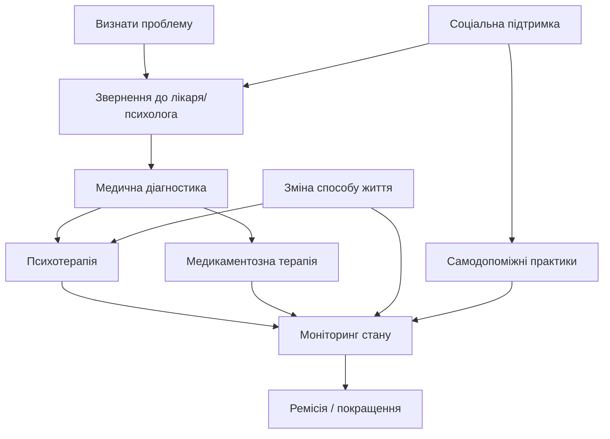
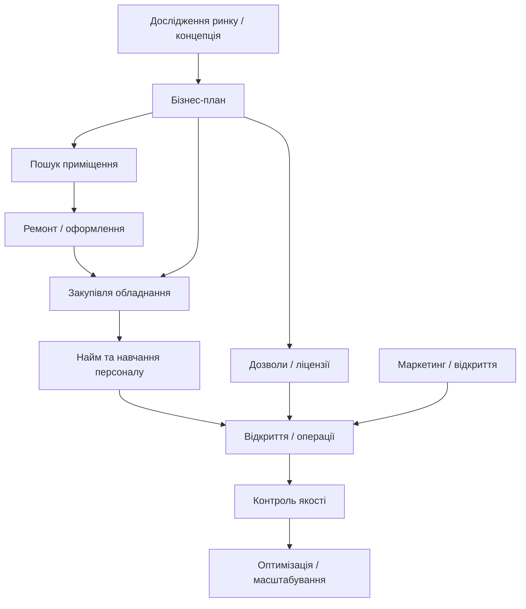
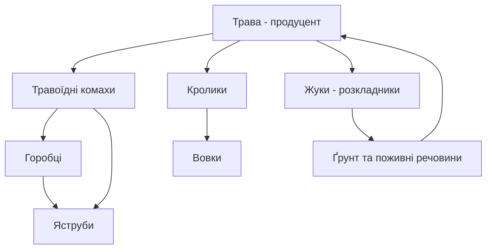
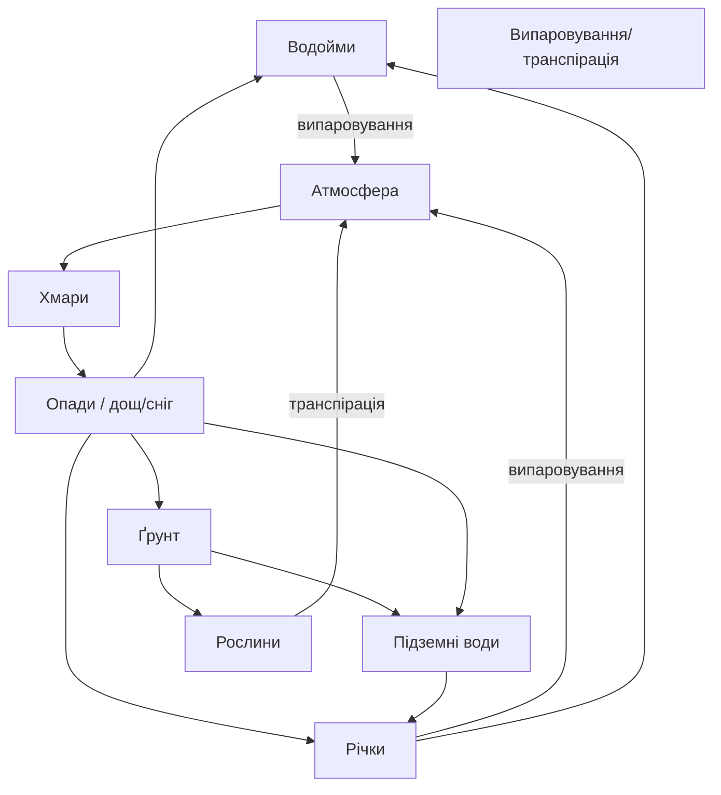

# Звіт

**Дисципліна:** Управління проєктами розробки інтелектуальних систем

**Тема:** Семантичні мережі (лекція 4)

**Мета:** Побудувати мережевий граф, що ілюструє порядок виконання операцій для 4 поставлених задач, пояснити вузли, залежності та критичні шляхи.

**Студент:** Чалий Сергій (КН-Н425, 13 в списку групи)

---

# 1. Перемогти депресію

---

# 2. Організувати роботу кав’ярні

---

# 3. Організувати систему харчування (екосистема: трава, кролики, вовки, травоїдні комахи, горобці, яструби, жуки)

---

# 4. Кругообіг води в природі
