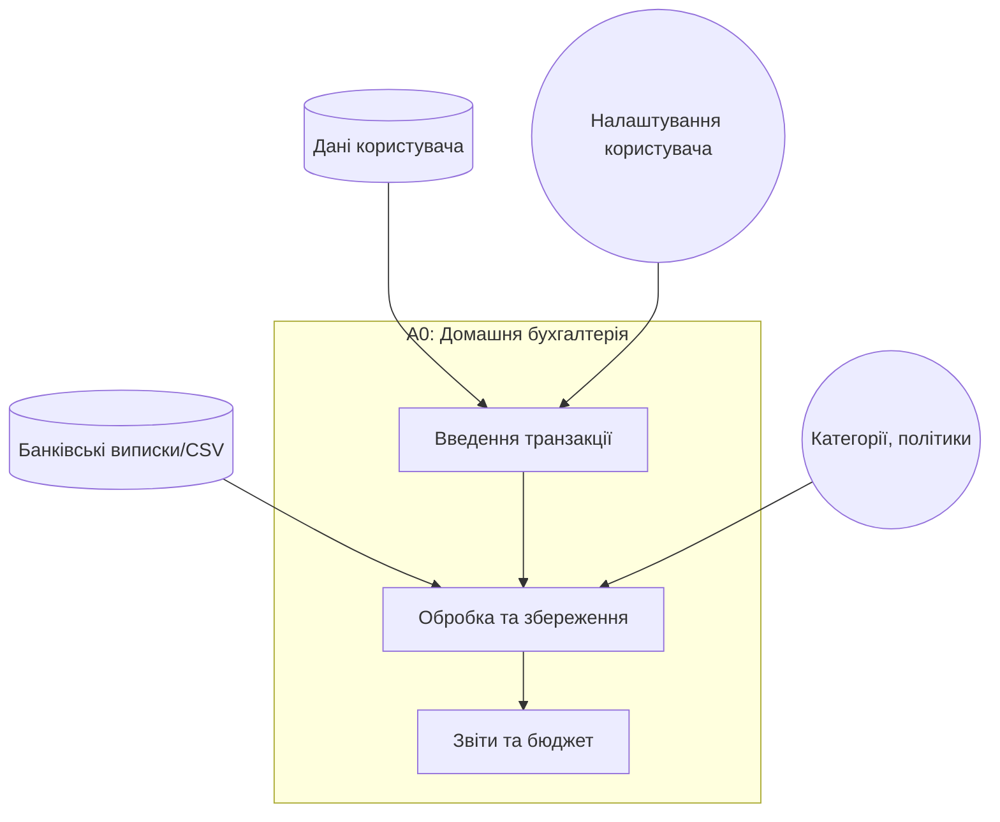
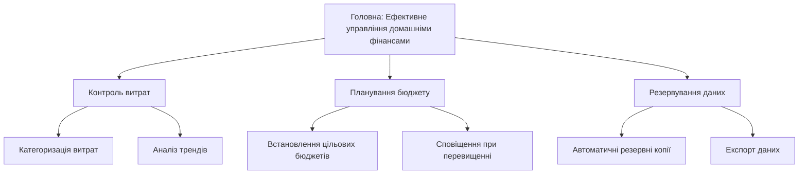
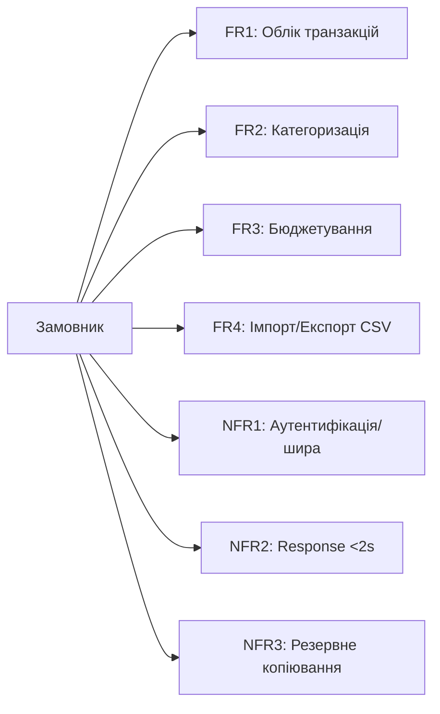
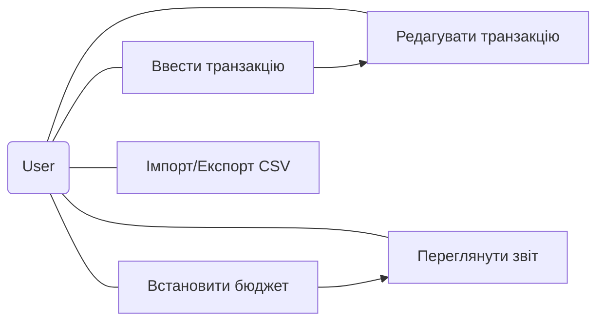

# Лабораторна робота №1

**Тема:** аналіз домену та формулювання вимог

### 1. Опис предметної області

Домашня бухгалтерія — процес збору, класифікації та аналізу фінансових операцій домогосподарства для контролю витрат і планування бюджету. Система дозволяє реєструвати доходи й витрати, встановлювати бюджети по категоріям, відстежувати залишки на рахунках (готівка, картки, рахунки), аналізувати тренди, генерувати звіти та нагадування про регулярні платежі. Інтерфейс орієнтований на непрофесіоналів — прості форми введення, шаблони категорій та автоматичні підказки. Система повинна підтримувати приватність даних та простий експорт для бухгалтера.

---

### 2. Визначені бізнес-процеси

**БП1 — Управління транзакціями (Реєстрація, редагування, категоризація).**
**БП2 — Бюджетування та звітність (встановлення бюджетів, контроль, звіти).**

#### 2.1 Словесно

* **БП1:** Користувач додає транзакцію → система пропонує категорію (авто/їжа/комуналка) → збереження → можливість редагувати/видаляти → синхронізація з резервними копіями.
* **БП2:** Користувач встановлює бюджет на період → система відстежує витрати по категоріях → якщо перевищення — сповіщення → генерується щомісячний звіт з графіками.

#### 2.2 Таблиці

БП1 (Управління транзакціями):

| Крок | Опис дій             | Вхід                      | Вихід                     | Учасники |
| ---: | -------------------- | ------------------------- | ------------------------- | -------- |
|    1 | Введення транзакції  | форма вводу               | чернетка транзакції       | Власник  |
|    2 | Автокатегоризація    | чернетка                  | категоризована транзакція | Система  |
|    3 | Підтвердження        | категоризована транзакція | запис у БД                | Власник  |
|    4 | Синхронізація/резерв | запис                     | резервна копія/лог        | Система  |

БП2 (Бюджетування та звітність):

| Крок | Опис                 | Вхід               | Вихід                 | Учасники |
| ---: | -------------------- | ------------------ | --------------------- | -------- |
|    1 | Встановлення бюджету | форма бюджету      | активний бюджет       | Власник  |
|    2 | Моніторинг           | транзакції         | показник використання | Система  |
|    3 | Сповіщення           | поріг перевищення  | повідомлення          | Система  |
|    4 | Звітність            | транзакції, бюджет | звіт/графіки          | Власник  |

#### 2.3 IDEF0 (2 рівня) — Mermaid approximation

(IDEF0 зазвичай має контекстну діаграму A-0; тут — спрощена блок-діаграма зі стрілками «вхід/вихід/контроль/механізм»)

---

### 3. Дерево цілей (3 рівні)

(коренева мета → підцілі → конкретні цілі)

---

### 4. Вимоги замовника (діаграма вимог)

Ключові вимоги (коротко): FR1 — облік транзакцій; FR2 — категоризація; FR3 — бюджети; FR4 — імпорт/експорт; NFR1 — безпека; NFR2 — продуктивність; NFR3 — резервне копіювання.

---

### 5. Діаграма прецедентів (Use cases) — Mermaid (Use case-like)

---

### 6. SRS — Специфікація вимог (стисло)

**1. Вступ**
1.1 Мета: надати специфікацію вимог для ІС «Домашня бухгалтерія».
1.2 Обсяг: веб- та мобільний клієнт, серверна частина, БД.

**2. Опис загальний**
2.1 Перспектива: самостійний ПЗ з можливістю імпорту банківських CSV; може інтегруватися з фінансовими сервісами у майбутньому.
2.2 Користувачі: Власник, Гість, Бухгалтер-консультант.

**3. Функціональні вимоги**

* FR1: Користувач може створювати/редагувати/видаляти транзакції (поля: сума, валюта, дата, категорія, рахунок, коментар).
* FR2: Система пропонує категорію на основі правил і історії (автокатегоризація).
* FR3: Користувач може створювати бюджети (категорія, період, сума); система контролює виконання та надсилає сповіщення.
* FR4: Імпорт/експорт CSV; резервна копія/відновлення.
* FR5: Генерація звітів за періодом / категоріями / рахунками.

**4. Нефункціональні вимоги**

* NFR1: Авторизація — email+пароль, опц. 2FA.
* NFR2: Шифрування чутливих даних у БД.
* NFR3: Відгук інтерфейсу <2 сек при типових запитах.
* NFR4: Локалізація інтерфейсу (укр/рос/англ).
* NFR5: Резервні копії щодня, збереження 30 днів.

**5. Обмеження**

* Підтримка лише офіційно вказаних валют (спочатку UAH, EUR, USD).

**6. Тестування**

* Юніт-тести для сервісів, інтеграційні тести імпорту/експорту, UI-smoke тестування.