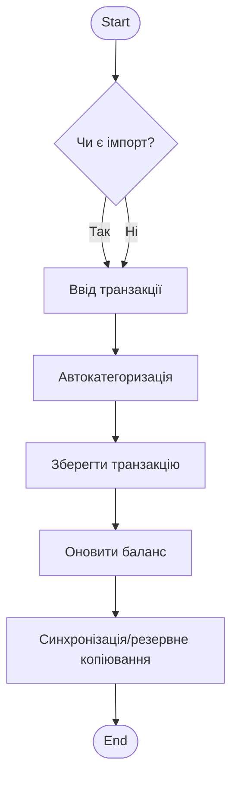
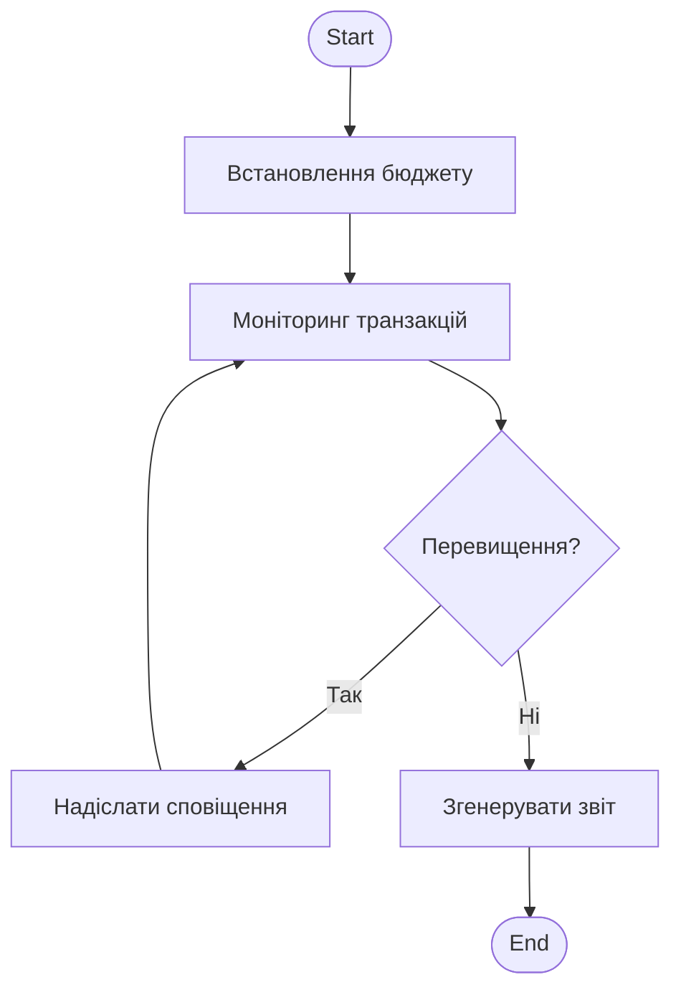
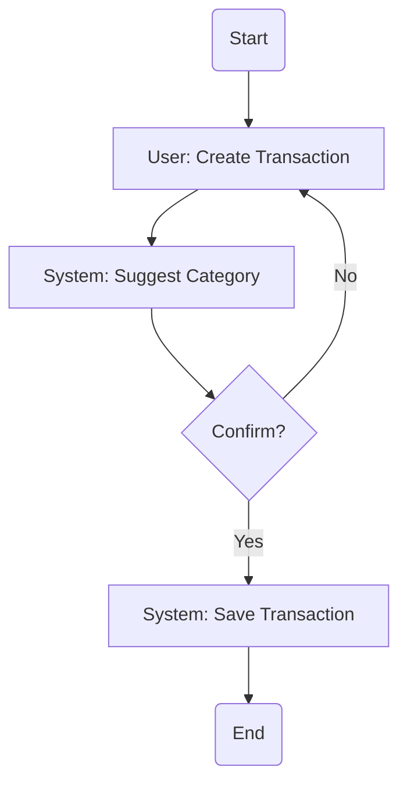
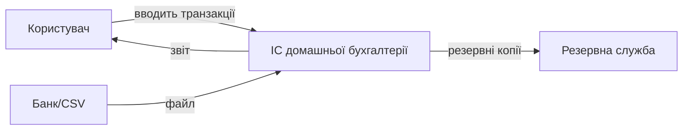
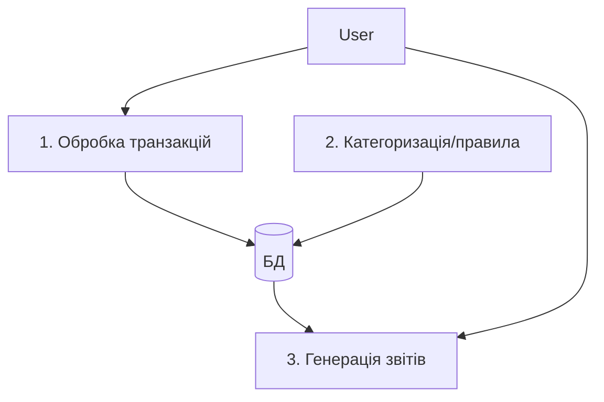

# Звіт: лабораторна робота №2

**Дисципліна:** Управління проєктами розробки інтелектуальних систем

**Тема:** моделювання домену

**Студент:** Чалий Сергій (КН-Н425, 13 в списку групи)

**Варіант:** 20

> Використовуючи бізнес-процеси з ЛР1.

---

### 1. Діаграми діяльності (Activity diagrams) — Mermaid

**БП1 — Управління транзакціями**

**БП2 — Бюджетування та звітність**

### 2. BPMN (приблизно) — Mermaid (flowchart used as BPMN-like)

(для академічних цілей цей формат прийнятний: можна використовувати спеціальні BPMN інструменти пізніше)

### 3. DFD (Data Flow Diagrams) — рівень контекст + DFD0

**Контекст (DFD0)**

**DFD0 внутрішні процеси**

