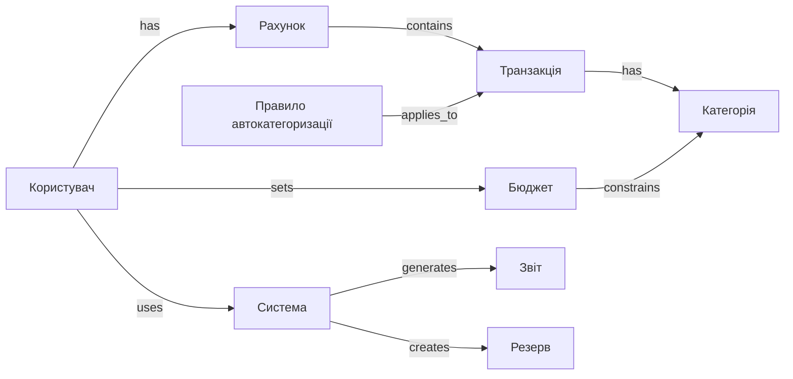

# Звіт: лабораторна робота №3

**Дисципліна:** Управління проєктами розробки інтелектуальних систем

**Тема:** Моделювання предметної області у вигляді семантичної мережі

**Студент:** Чалий Сергій (КН-Н425, 13 в списку групи)

**Варіант:** 20

---

### Сутності (вузли)

* User (Користувач)
* Account (Рахунок)
* Transaction (Транзакція)
* Category (Категорія)
* Budget (Бюджет)
* Report (Звіт)
* Backup (Резерв)
* Rule (Правило автокатегоризації)

### Відношення (семантичні)

* User HAS Account
* Account CONTAINS Transaction
* Transaction HAS Category
* User SETS Budget
* Budget CONSTRAINS Category
* System GENERATES Report
* System CREATES Backup
* Rule APPLIES_TO Transaction

### Mermaid (семантична мережа — граф)

### Пояснення

Семантична мережа показує клас-подібні відношення та роль системи як агента, що генерує звіти і резервні копії. Правила автокатегоризації зв’язуються з транзакціями для автоматичного присвоєння категорій.