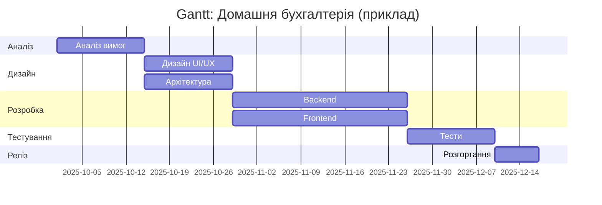
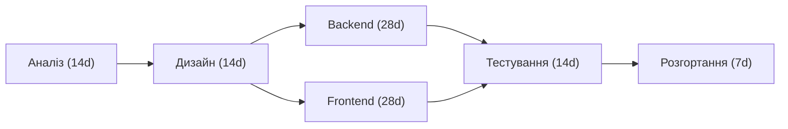

# Звіт: лабораторна робота №5

**Дисципліна:** Управління проєктами розробки інтелектуальних систем

**Тема:** Складання календарного плану IT-проекту

**Студент:** Чалий Сергій (КН-Н425, 13 в списку групи)

**Варіант:** 20

---

### 1. Ієрархічна структура робіт (WBS)

1.0 Проект: Домашня бухгалтерія

1.1 Аналіз та вимоги (ЛР1) — 2 тижні

1.2 Дизайн (UX/UI, архітектура) — 2 тижні

1.3 Реалізація backend — 4 тижні

1.4 Реалізація frontend — 4 тижні

1.5 Тестування (unit, integration, UI) — 2 тижні

1.6 Розгортання та документація — 1 тиждень

1.7 Відповідність/резервування та підтримка — 1 тиждень

### 2. Логічні зв’язки (залежності)

* 1.2 залежить від 1.1
* 1.3 залежить від 1.2
* 1.4 залежить від 1.2
* 1.5 залежить від 1.3 та 1.4
* 1.6 залежить від 1.5

### 3. Часові рамки (приклад)

Припустимо початок проекту: 01.10.2025

* Аналіз: 01.10 — 14.10 (2 тижні)
* Дизайн: 15.10 — 28.10
* Backend: 29.10 — 25.11 (4 тижні)
* Frontend: 29.10 — 25.11
* Тестування: 26.11 — 09.12
* Розгортання: 10.12 — 16.12
  (Регулюйте дати під ваш графік семестру.)

### 4. Gantt (Mermaid)

### 5. Основні учасники проекту та ролі

* Project Manager — координація, контроль термінів
* Business Analyst — аналіз вимог, SRS
* UX/UI Designer — інтерфейс
* Backend Developer (1-2) — API, БД
* Frontend Developer (1-2) — UI, інтеграція
* QA Engineer — тести
* DevOps — розгортання/резервні копії

### 6. Ресурси

* Людські: 7 осіб (PM, BA, 2 Backend, 2 Frontend, QA, DevOps) — можна оптимізувати.
* Технічні: сервер (VPS), CI/CD (GitHub Actions), DB (PostgreSQL), сховище для бекапів (S3-подібне), SSL-сертифікати.
* Ліцензії: інструменти дизайнерів, платформи тестування (за потреби).

### 7. Розподіл завдань між учасниками (приклад)

* BA: ЛР1 (SRS)
* Designer: wireframes, prototyping
* Backend Devs: API, auth, import/export, backup
* Frontend Devs: форми вводу, dashboard, графіки
* QA: тестові сценарії, тестування релізу
* DevOps: налаштування хостингу, CI/CD, backup

### 8. Матриця вимог (Requirement traceability matrix) — приклад (коротко)

|   ID | Вимога           | Пріоритет | Тести    | Відповідальний   |
| ---: | ---------------- | --------: | -------- | ---------------- |
|  FR1 | Облік транзакцій |      High | UT1, IT1 | Backend          |
|  FR2 | Категоризація    |      High | UT2      | Backend          |
|  FR3 | Бюджетування     |    Medium | IT2      | Frontend+Backend |
|  FR4 | Імпорт/Експорт   |    Medium | IT3      | Backend          |
| NFR1 | Аутентифікація   |      High | SEC1     | Backend/DevOps   |

### 9. Мережна діаграма (PERT/CPM)

(приклад зі стислими тривалостями у днях)

Критичний шлях у прикладі: Аналіз → Дизайн → Backend → Тестування → Розгортання (тривалість = 14+14+28+14+7 = 77 днів). Якщо frontend і backend однакові за тривалістю, обираємо шлях, що дає максимальну суму.
