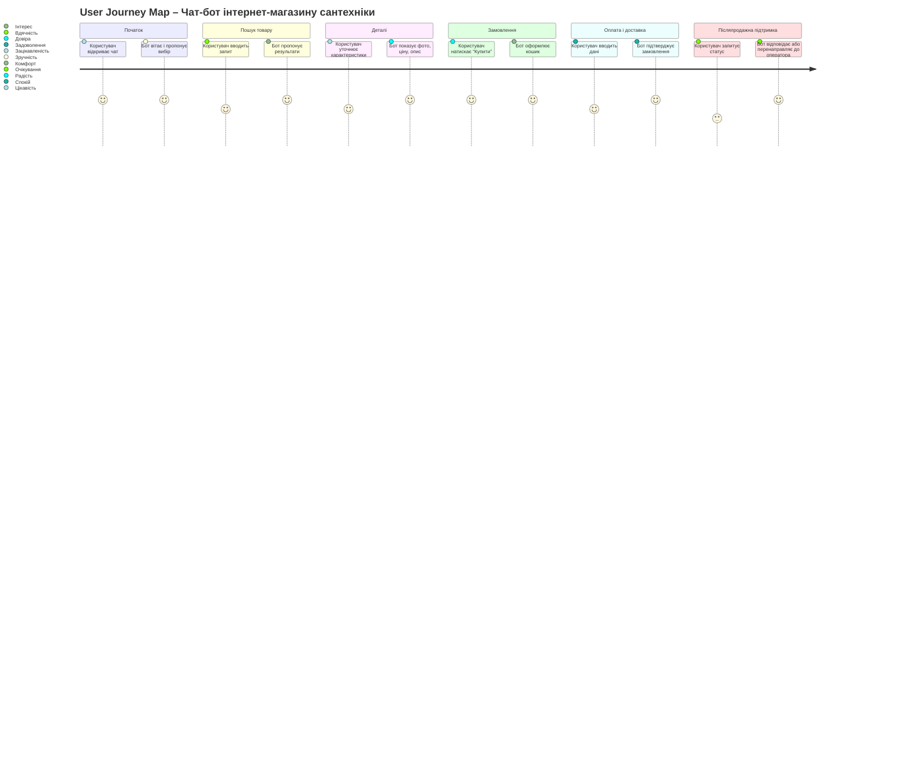

## **ЛАБОРАТОРНА РОБОТА №2**

**Тема:** Розробка User Journey Mapping для чат-бота, заснованого на правилах
**Виконав:** студент 5 курсу, групи КН-425 — **Сергій Чалий**
**Перевірила:** викладач — **Оксана Іващенко**
**Харків — 2025**

---

### **Мета роботи**

Отримати навички створення карти користувацького шляху (*User Journey Map*) для чат-бота інтернет-магазину сантехніки, що дозволяє визначити ключові етапи взаємодії користувача з ботом і логіку його поведінки на основі визначених правил.

---

### **Основні та додаткові цілі чат-бота**

**Бізнес-цілі:**

* Підвищення рівня обслуговування клієнтів.
* Зменшення навантаження на операторів.
* Автоматизація консультацій і пошуку товарів.
* Збільшення продажів завдяки швидкому реагуванню на запити.

**Цілі чат-бота:**

* Допомога користувачам у виборі сантехніки.
* Надання інформації про наявність, доставку, оплату.
* Відповіді на часті запитання.
* Консультації щодо підбору товарів.

---

### **Профілі користувачів (User Personas)**

1. **Іван, 35 років — приватний клієнт**
   Потреба: швидко знайти і замовити сантехніку для ремонту.
   Болі: не хоче витрачати час на дзвінки або очікування відповіді консультанта.
   Очікування: швидкий пошук, прості відповіді, можливість оплатити онлайн.

2. **Олена, 28 років — дизайнер інтер’єрів**
   Потреба: знайти стильні моделі, отримати технічні характеристики.
   Болі: важко знайти товари з певними параметрами.
   Очікування: зручна навігація, рекомендації від бота.

3. **Андрій, 45 років — монтажник сантехніки**
   Потреба: перевірити наявність певних деталей та швидко оформити доставку.
   Очікування: оперативні відповіді, точність інформації, мінімум кліків.

---

### **Ключові етапи взаємодії користувача з чат-ботом**

1. Початок діалогу (вітання, коротке меню).
2. Пошук товару за категорією або ключовим словом.
3. Уточнення деталей (ціна, матеріал, виробник).
4. Додавання товару до кошика.
5. Оформлення замовлення (доставка, оплата).
6. Підтвердження та отримання інформації про статус замовлення.
7. Післяпродажна підтримка (повернення, гарантія, контакт із менеджером).

---

### **Сценарії дій користувача та чат-бота**

| Етап             | Дії користувача                    | Дії чат-бота                                  | Емоції користувача | Можливі покращення                             |
| ---------------- | ---------------------------------- | --------------------------------------------- | ------------------ | ---------------------------------------------- |
| 1. Початок       | Користувач відкриває чат           | Бот вітає, пропонує меню дій                  | Цікавість          | Персоналізувати привітання                     |
| 2. Пошук товару  | Вводить назву або обирає категорію | Бот показує результати, уточнює параметри     | Задоволення        | Додати фото та фільтри                         |
| 3. Деталі        | Запитує характеристики             | Бот надає технічні дані                       | Довіра             | Додати кнопку “Порівняти товари”               |
| 4. Замовлення    | Обирає “Купити”                    | Бот формує кошик                              | Радість            | Додати рекомендації                            |
| 5. Оплата        | Обирає спосіб оплати               | Бот перенаправляє на платіжну сторінку        | Упевненість        | Додати “збереження картки”                     |
| 6. Підтвердження | Очікує підтвердження               | Бот повідомляє номер замовлення               | Спокій             | Відправляти статуси у месенджер                |
| 7. Підтримка     | Звертається після покупки          | Бот надає інструкції або зв’язує з оператором | Задоволення        | Навчити бота відповідати на гарантійні питання |

---

### **Графічна діаграма User Journey Map (схематичне зображення)**

---

### **Тестування карти користувацького шляху**

Тестування проводиться шляхом:

* перевірки логіки переходів між етапами;
* симуляції діалогу з ботом для виявлення “сліпих зон”;
* оцінки користувацького досвіду за допомогою опитувань або аналітики (кількість кліків, час до завершення замовлення).

---

### **Висновки**

У результаті виконання роботи було створено карту користувацького шляху для чат-бота інтернет-магазину сантехніки.
Вона показує логіку дій користувача і чат-бота на кожному етапі, дозволяє виявити точки покращення взаємодії й забезпечує основу для подальшого проєктування сценаріїв спілкування.

---

### **Контрольні питання (з відповідями)**

1. **Мета створення карти користувацького шляху:** визначення логіки поведінки користувача та ботa для покращення UX.
2. **Чому важливо визначати профілі користувачів:** щоб адаптувати бот під різні типи клієнтів.
3. **Основні етапи створення карти:** визначення цілей, створення персон, опис етапів, розробка сценаріїв, візуалізація, тестування.
4. **Зв’язок карти та сценаріїв:** сценарії формуються на основі карти.
5. **Інструменти:** Miro, Lucidchart, Figma.
6. **Тестування:** моделювання діалогів, опитування користувачів.
7. **Критерії вибору інструменту:** зручність, наявність шаблонів, можливість експорту.
8. **Якщо бракує інформації:** проводити інтерв’ю, аналізувати конкурентів.
9. **Різні типи користувачів:** використовувати кілька персон.
10. **Проблеми:** надмірна деталізація, нечіткі переходи між етапами.
11. **Оцінка ефективності:** через аналітику поведінки користувачів.
12. **Персоналізація:** дозволяє адаптувати досвід під конкретного користувача.
13. **Зміни для різних галузей:** етапи й акценти відрізняються залежно від бізнес-моделі.
14. **Виклики:** складність візуалізації великої кількості сценаріїв.
15. **Аналітика:** допомагає оновлювати карту на основі реальних даних.
16. **Роль карти:** служить основою для логіки чат-бота й його подальшої розробки.
