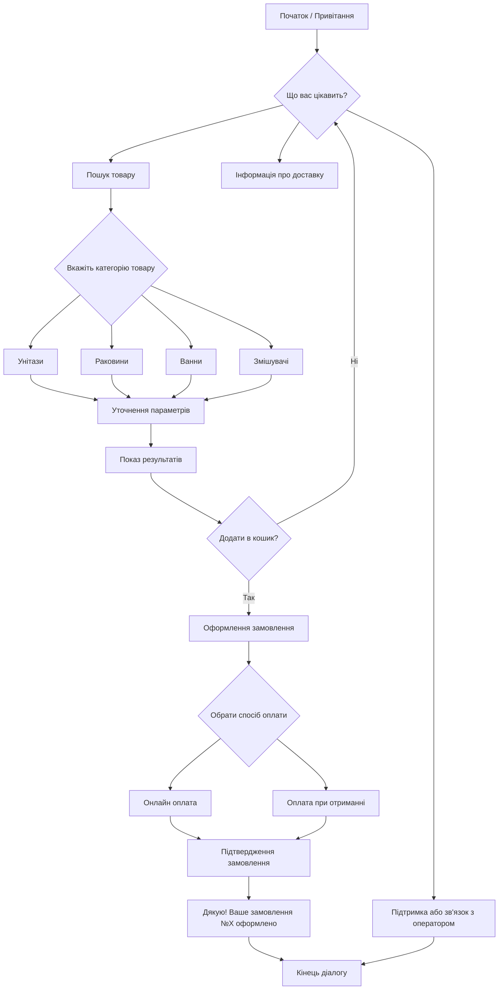

## **ЛАБОРАТОРНА РОБОТА №3**

**Тема:** Розробка та візуалізація дерева рішень для потоку розмови чат-бота
**Виконав:** студент 5 курсу, групи КН-425 — **Сергій Чалий**
**Перевірила:** викладач — **Оксана Іващенко**
**Харків — 2025**

---

### **Мета роботи**

Розробити та візуалізувати дерево рішень для чат-бота інтернет-магазину сантехніки, що допомагає користувачам швидко знаходити, замовляти та оплачувати товари. Навчитись формалізувати логіку розмови через послідовність станів і переходів між ними.

---

### **Визначення станів чат-бота**

Для інтернет-магазину сантехніки було визначено такі стани:

1. **Привітання** — бот вітає користувача і пропонує основні варіанти дій.
2. **Пошук товару** — користувач обирає категорію або вводить назву.
3. **Уточнення параметрів** — бот запитує додаткові характеристики (тип, виробник, ціна).
4. **Виведення результатів** — бот показує знайдені товари.
5. **Оформлення замовлення** — бот збирає контактні дані, спосіб доставки.
6. **Оплата** — бот пропонує варіанти оплати.
7. **Підтвердження замовлення** — бот надсилає номер замовлення.
8. **Завершення діалогу** — дякує за покупку і пропонує повернутися в меню.
9. **Передача до оператора** — у випадку, якщо користувач має питання поза сценарієм.

---

### **Графічна діаграма дерева рішень**

---

### **Опис логіки переходів**

* Після привітання користувач обирає, що саме його цікавить (каталог, доставка або підтримка).
* Якщо він шукає товар — бот уточнює категорію, потім параметри.
* Після цього бот показує результати й пропонує оформити замовлення.
* На етапі оформлення бот уточнює спосіб оплати, після чого видає підтвердження.
* У будь-який момент користувач може перейти до оператора.
* Діалог завершується повідомленням «Дякуємо за покупку!».

---

### **Врахування бізнес-логіки**

Бот спрямований на автоматизацію продажів і консультацій. Тому в дереві передбачені:

* швидкий перехід до оформлення замовлення;
* варіанти відмови або повернення в головне меню;
* можливість зв’язку з оператором для нестандартних випадків.

---

### **Висновки**

У ході роботи було розроблено повне дерево рішень для rule-based чат-бота інтернет-магазину сантехніки.
Дерево визначає всі можливі етапи взаємодії, забезпечує логічну послідовність розмови, а також відповідає бізнес-цілям: швидкість, зручність і автоматизація.
Створена структура може бути безпосередньо використана для програмної реалізації сценарію чат-бота.

---

### **Контрольні запитання (з відповідями)**

1. **Роль дерева рішень у чат-боті:** воно задає логіку переходів і контролює поведінку системи.
2. **Навіщо візуалізувати потік розмови:** щоб бачити структуру діалогу і перевірити логіку.
3. **Зв’язок із картою користувацького шляху:** карта показує досвід користувача, а дерево — внутрішню логіку дій.
4. **Основні елементи дерева:** стани, переходи, умови, кінцеві вузли.
5. **Інструменти:** Miro, Lucidchart, Draw.io, Mermaid.
6. **Як визначаються стани:** за сценаріями з User Journey Map.
7. **Фактори переходів:** дії користувача, ключові слова, обрані опції.
8. **Як забезпечити послідовність:** спланувати всі гілки й кінцеві стани.
9. **Типи кінцевих станів:** завершення діалогу, оформлення замовлення, передача до оператора.
10. **Передача оператору:** передбачена гілка для складних випадків.
11. **Переваги дерева:** прозорість логіки, простота підтримки, контроль поведінки.
12. **Оптимізація:** аналіз частих сценаріїв і скорочення непотрібних вузлів.
13. **Відмінності в різних галузях:** структура залежить від типу сервісу (банки, e-commerce, туризм).
14. **Виклики:** зростання складності при додаванні нових сценаріїв.
15. **Масштабованість:** через модульну структуру — можна додавати піддерева для нових функцій.

